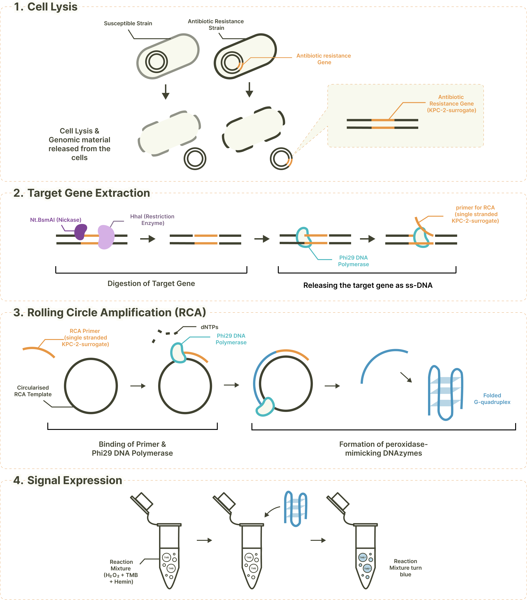

This pages outlines our project, the concept behind it, and the goals we set out to achieve.  

# Our History

The COVID-19 pandemic has popularised the concept and the use of **point-of-care testing kits**. Inspired by this, our team is attempting to develop a novel point-of-care testing kit that can **detect different antibiotic resistance types** in a versatile manner. We initially identified a potential tool that might help us construct our kit: the **8-17 deoxyribozymes (DNAzymes)**, together with the **stem-loop- and fluoroprobe-containing oligonucleotides**. These DNAzymes can **receive inputs at their stem-loops**, which will then **expose their catalytic sites** and **cause cleavage of the oligonucleotides** to produce **fluorescence** [[1]](#reference-1). Using this **[biological logic gate](https://www.instagram.com/p/C5LtiqJBGTS) system**, we planned to utilise the DNAzymes stem-loops to **detect resistance genes**.  

However, upon consulting the ideas with our PIs and PoC experts, we realised that a detection kit that depends on fluorescence-based results is **[not the ideal choice](/human-practices#results-display-and-verification)** for constructing a point-of-care diagnostic kit. Thus, we [shifted our focus](/human-practices#project-modification---) towards developing a kit that generates **colourimetric results** instead.  

# Problem Background

## Antibiotic Resistance

Antibiotics, used for **over a century** to treat bacterial infections, are among the **most successful medical interventions**. However, antibiotic resistance has increased due to **overuse**, causing **previously manageable diseases to resurface**. Many infectious diseases that antibiotics used to be effective against have become more severe problems in recent years.  

### Current Death Toll and Future Projections

In a study published in 2022, it was estimated that **4.95 million (95% CI 3.62-6.57 million) deaths** were associated with antimicrobial resistance (AMR) in 2019, with **1.27 million of them attributed to bacterial AMR** [[2]](#reference-2). These figures indicate that deaths due to AMR represent a major global health concern, **comparable in scale to leading causes of mortality** such as ischaemic heart disease, stroke, and chronic obstructive pulmonary disease [[3]](#reference-3).  

Out of the 4.95 million AMR-associated deaths, a staggering **4.3 million are occurring in low- and middle-income countries (LMICs)** [[4]](#reference-4). This stark disparity underscores the urgent need to **enhance infection prevention and control** and to **improve access to affordable diagnoses** in these regions. The Lancet Series on Antimicrobial Resistance suggests that **aligning infection prevention and control standards** in LMICs' healthcare settings with those in high-income countries could prevent up to 337,000 AMR-associated deaths annually [[4]](#reference-4).  

### Leading Causes of AMR

The rise of antibiotic resistance is **primarily fuelled by the high selective pressure** caused by the increasing use and misuse of antibiotics over the years. In the past two decades, global antimicrobial use has **increased by 46%** [[3]](#reference-3). The overuse of antibiotics provides an advantage for resistant bacteria, causing them to proliferate since they survive better in the environment than their susceptible competitors [[3]](#reference-3).  

In nature, **horizontal gene transfer** occurs among species of bacteria. This process enables bacteria to **exchange their genetic material**, including antibiotic resistance genes (ARGs), often across multiple species, greatly facilitating **collaboration among bacterial populations in the development of multidrug resistance (MDR)** [[5]](#reference-5). Obviously, MDR leads to escalations in the severity of the problem, the most evident of which being **superbugs**, which are strains of bacteria resistant to several types of antibiotics. This phenomenon dramatically challenges the treatment process of a bacterial infection. 

### Concerning Implications

In a broader scope, AMR causes problems **beyond the increased challenge of treating bacterial infection**. It also complicates the treatment of chronic kidney disease, diabetes and associated urinary tract and foot infections, chronic obstructive pulmonary disease, liver cirrhosis, as well as surgical care due to **the risk of exposure to resistant infections** [[3]](#reference-3). In addition, AMR impedes progress towards the global childhood survival rate targeted by [Sustainable Development Goal 3: *Good Health and Well-being*](https://www.globalgoals.org/goals/3-good-health-and-well-being/). This is because **one-third of newborn deaths are caused by infections**, with half of these infection-related deaths attributed explicitly to **sepsis** [[3]](#reference-3). Worryingly, the pathogens driving these deadly infections are becoming increasingly resistant to the most widely used antibiotic treatments [[3]](#reference-3).  

Furthermore, the rise of antimicrobial resistance has diminished the effectiveness of previously useful antimicrobial drugs, causing access to antimicrobials previously considered second-line to become increasingly crucial [[3]](#reference-3). The Organisation for Economic Cooperation and Development (OECD) projects a **twofold surge in resistance to last-resort antibiotics** from 2005 to 2035 based on current trends [[6]](#reference-6).  

### Future Outlook

In addressing the problems of antibiotic resistance, **the Lancet series**, in 2024, proposed **three goals to be achieved globally** by 2030: a **10% decrease in deaths from AMR**, a **20% reduction in inappropriate human antibiotic use**, and a **30% reduction of that in animals** [[7]](#reference-7). These goals can only be achieved with **optimised global surveillance**, including **fast and accurate diagnoses** to prevent the misuse of ineffective antibiotics, which only furthers resistance prevalence.  

However, current technologies for diagnosing antibiotic resistance, such as **minimum inhibitory concentration (MIC), require lengthy culturing**, while **genetic tests like PCR necessitate trained personnel**. Additionally, routine bacteriological culture testing is **available in only 1.3% of laboratories** in sub-Saharan Africa [[8]](#reference-8). To counteract the rising trend of antibiotic resistance and to provide better access to diagnostic kits in **low-resource settings**, a **cheaper, faster, and simpler technology** is needed.  

## *Klebsiella pneumoniae*

### Antibiotic Resistance in *Klebsiella pneumoniae*

***Klebsiella pneumoniae*** is often cited as a common cause of pneumonia [[9]](#reference-9). It is a **gram-negative, encapsulated, and non-motile bacterium** found in the environment, mainly **colonising human mucosal surfaces** of the oropharynx and gastrointestinal (GI) tract [[9]](#reference-9). *Klebsiella pneumoniae* infection is best treated with **third- and fourth-generation cephalosporins, quinolones, or carbapenems** [[10]](#reference-10). However, over the years, *Klebsiella pneumoniae* has been shown to produce **extended-spectrum beta-lactamase (ESBL)** that breaks down and **deactivates beta-lactam antibiotics**, including cephalosporin, rendering third-generation cephalosporin drugs ineffective for treating *Klebsiella pneumoniae* infections.  

Additionally, cases of **carbapenem-resistant *Klebsiella pneumoniae*** have also been discovered. This thus classifies *Klebsiella pneumoniae* as one of the **carbapenemase-producing Enterobacteriaceae (CPE)**. Similar to beta-lactamase, carbapenem resistance is conferred by producing carbapenemase capable of **hydrolysing and neutralising** the drug molecule [[11]](#reference-11), [[12]](#reference-12). Notably, carbapenemases are encoded on plasmids such as **blaKPC** and **blaNDM-1** [[13]](#reference-13). This means it can be easily transferred between bacteria through **horizontal gene transfer**, resulting in a more vigorous spread of the resistance [[14]](#reference-14).  

### Urgency for Detection

In terms of its resistant variants, resistant *Klebsiella pneumoniae* commonly causes **community-acquired urinary tract infections** along with resistant *Escherichia coli*, *Proteus mirabilis*, and *Staphylococcus saprophyticus* [[3]](#reference-3). According to the World Health Organisation, *Klebsiella pneumoniae* showed elevated resistance levels against major antibiotics, **compromising the effectiveness of these last-resort drugs** and **increasing the risk of untreatable infections** [[6]](#reference-6). This indicates that *Klebsiella pneumoniae* is one of the most significant pathogens regarding antibiotic resistance. Additionally, the 2024 Lancet series emphasised the need for novel strategies to **address the burden of ESKAPE pathogens**, which includes *Klebsiella pneumoniae* [[4]](#reference-4), [[13]](#reference-13).  

### Low-Resource Settings

Among the estimated 1.27 million deaths caused by AMR, *Klebsiella pneumoniae* was **one of the six leading contributing pathogens** [[2]](#reference-2). In **sub-Saharan Africa**, *Klebsiella pneumoniae* contributed to **19.9% of deaths** caused by AMR and **17.5% of AMR-associated mortality** [[2]](#reference-2). Other than that, *Klebsiella pneumoniae* is one of the most common causes of **neonatal sepsis** in low-resource settings, such as in sub-Saharan Africa [[3]](#reference-3), [[15]](#reference-15). Although it is estimated that only 3-5% of all community-acquired pneumonia in Western culture is related to *Klebsiella pneumoniae* infection, in developing countries such as African countries, for example, community-acquired *Klebsiella pneumoniae* accounts for roughly **15% of all pneumonia cases** [[9]](#reference-9).  

With this regard, we consider *Klebsiella pneumoniae* as our **starting focus** in developing our diagnosis method. With its level of urgency, especially in low-resource settings, performing diagnosis of resistant *Klebsiella pneumoniae* in a **simple and low-cost manner** will benefit the community for more effective usage of antibiotics and **enhanced surveillance**.  

# Our Solution

We are developing a point-of-care test kit, **ResiSense**, for more efficient screening using **cell-free systems**. This proposed testing system consists of **target gene extraction**, **rolling circle amplification (RCA)**, and **signal expression**.  

## Mechanism of Action

  

After cell **lysis releases bacterial DNA**, a snippet of the target gene responsible for antibiotic resistance is cut using a pair of **restriction enzymes and nickase**. The **Φ-29 polymerase aids in releasing the target gene** as ss-DNA. This target gene serves as a **primer** and triggers the formation of **peroxidase-mimicking DNAzymes, G-quadruplex** through rolling circle amplification (RCA). Finally, the G-quadruplex DNAzymes cause an **observable colour change in the solution**, indicating the presence of antibiotic-resistant genes in bacteria.  

All processes in our detection system are designed to occur in **isothermal conditions**, specifically at **room temperature**, and **do not require dedicated, large on-site hardware**. Our aim is to create a **versatile, easily programmable system** that can adapt to various settings and detect a wide range of antibiotic resistance genes, starting with those related to *Klebsiella pneumoniae*.  

## Explainer Video

Please feel free to watch this video for an animated explanation of our project. You can also watch the video on the [iGEM video universe](https://video.igem.org/w/br2ZeGqbCSCF5SKxd5bF6G) or [YouTube](https://www.youtube.com/watch?v=sOPuCzF1nOM).  

This video is loading... Please wait.  

If the video does not load, you can also watch the video on the [iGEM video universe](https://video.igem.org/w/br2ZeGqbCSCF5SKxd5bF6G) or [YouTube](https://www.youtube.com/watch?v=sOPuCzF1nOM).

<iframe title="HongKong-CUHK: ResiSense Mechanism Overview (2024) [English]" src="https://video.igem.org/videos/embed/547a348d-112a-46ef-afbf-f17b1e0d5a56" frameborder="0" allowfullscreen="" sandbox="allow-same-origin allow-scripts allow-popups allow-forms">

If the video does not load, you can also watch the video on the [iGEM video universe](https://video.igem.org/w/br2ZeGqbCSCF5SKxd5bF6G) or [YouTube](https://www.youtube.com/watch?v=sOPuCzF1nOM).

</iframe>

## Choice of Target Bacterium and Gene Fragment

***Klebsiella pneumoniae* Carbapenemase (KPC)** are **β-lactamases** produced by gram-negative bacteria, responsible for the resistance towards **penicillins, cephalosporins, monobactams, carbapenems, and other β-lactamase inhibitors** [[16]](#reference-16). KPCs are among the most widespread carbapenemases, with **blaKPC-2 as China's most prevalent gene variant** [[17]](#reference-17), [[18]](#reference-18). Also, the [Centre for Health and Protection](https://www.chp.gov.hk/en) of Hong Kong has reported **2118 cases of *Klebsiella pneumoniae* infection** in 2023, with approximately 111 cases exhibiting **extended-spectrum β-lactamase positive (ESBL+) phenotype** [[19]](#reference-19). Hence, we believe that due to the prevalence of KPC in the worldwide and regional context, there is a definite need for a test kit for **detecting blaKPC-2 from *Klebsiella pneumoniae***.  

# Our Vision

As reported in the 2024 Lancet Series on Antimicrobial Resistance, **preserving the effectiveness of antibiotics** will depend on **accurate and timely diagnosis** of bacterial infections [[7]](#reference-7). However, the scaling up of diagnostic technologies faces numerous challenges, including **technological, economic, and behavioural difficulties** [[7]](#reference-7). Thus, this project is mainly about developing an affordable, simple, yet accurate diagnostic kit to **provide better accessibility to diagnostic technologies** in low-resource settings by eliminating the problems of **lengthy culturing**, the need for **specialised machines**, and **trained personnel**.  

After successfully running our systems to detect the resistance genes of *Klebsiella pneumoniae*, we plan to expand the project to **detect resistance genes of other bacterial species** in addition to **identifying the species** itself. We understand that diagnosing resistance is insufficient without information on the species. Thus, in the future, we will also adapt the detection system to recognise and report the bacteria species that cause the infection.  

In the long run, with the lower cost and decent turnaround time, our technology has the potential to help doctors **choose the right antibiotics to prescribe**, thereby saving lives that would otherwise be lost without access to **MALDI-TOF**. Our technology also helps prevent the spread of antibiotic resistance by **alerting medical professionals** of its existence. Financially, we target to open up a new market that was **previously unreachable with the current technologies**. Lastly, we aim to create an impact in research by developing a methodology that could be readily **adapted to detecting other segments of genes** in any organism, helping other researchers develop accessible diagnostic tests based on our platform.  

# References

1. M. N. Stojanović and D. Stefanović, "Deoxyribozyme-based half-adder", *Journal of the American Chemical Society*, vol. 125, no. 22, pp. 6673–6676, May 2003. doi: [10.1021/ja0296632](https://www.doi.org/10.1021/ja0296632)
2. C. J. Murray *et al.*, "Global burden of bacterial antimicrobial resistance in 2019: A systematic analysis", *The Lancet*, vol. 399, no. 10325, pp. 629–655, Feb. 2022. doi: [10.1016/s0140-6736(21)02724-0](https://www.doi.org/10.1016/s0140-6736(21)02724-0)
3. I. N. Okeke *et al.*, "The scope of the Antimicrobial Resistance Challenge", *The Lancet*, vol. 403, no. 10442, pp. 2426–2438, Jun. 2024. doi: [10.1016/s0140-6736(24)00876-6](https://www.doi.org/10.1016/s0140-6736(24)00876-6)
4. J. A. Lewnard *et al.*, "Burden of bacterial antimicrobial resistance in low-income and middle-income countries avertible by existing interventions: An evidence review and modelling analysis", *The Lancet*, vol. 403, no. 10442, pp. 2439–2454, Jun. 2024. doi: [10.1016/s0140-6736(24)00862-6](https://www.doi.org/10.1016/s0140-6736(24)00862-6)
5. D. Sun, K. Jeannot, Y. Xiao, and C. W. Knapp, "Editorial: Horizontal gene transfer mediated bacterial antibiotic resistance", *Frontiers in Microbiology*, vol. 10, Aug. 2019. doi: [10.3389/fmicb.2019.01933](https://www.doi.org/10.3389/fmicb.2019.01933)
6. "Antimicrobial resistance", World Health Organisation, https://www.who.int/news-room/fact-sheets/detail/antimicrobial-resistance (accessed Apr. 14, 2024).
7. "Sustainable Access to Effective Antibiotics: An Executive Summary for The Lancet’s Series", The Lancet Series on Antimicrobial Resistance: The need for sustainable access to effective antibiotics, https://www.thelancet.com/series/antibiotic-resistance?dgcid=tlcom\_infographic\_amr2024\_lancet (accessed Jun. 17, 2024).
8. R. Laxminarayan *et al.*, "Expanding antibiotic, vaccine, and diagnostics development and access to tackle antimicrobial resistance", *The Lancet*, vol. 403, no. 10443, pp. 2534–2550, Jun. 2024. doi: [10.1016/s0140-6736(24)00878-x](https://www.doi.org/10.1016/s0140-6736(24)00878-x)
9. J. V. Ashurst and A. Dawson, "Klebsiella Pneumonia", *StatPearls* [Internet]. Treasure Island (FL): StatPearls Publishing, Jan. 2024. [Online]. Available: https://www.ncbi.nlm.nih.gov/books/NBK519004/. (accessed Jun. 18, 2024).
10. S. E. Prince, K. A. Dominger, B. A. Cunha, and N. C. Klein, "*Klebsiella pneumoniae* pneumonia", *Heart & Lung*, vol. 26, no. 5, pp. 413–417, Sep./Oct. 1997. doi: [10.1016/s0147-9563(97)90028-5](https://www.doi.org/10.1016/s0147-9563(97)90028-5)
11. L. D. Hughes, A. Aljawadi, and A. Pillai, "An overview of carbapenemase producing Enterobacteriaceae (CPE) in Trauma and Orthopaedics", *Journal of Orthopaedics*, vol. 16, no. 6, pp. 455–458, Nov./Dec. 2019. doi: [10.1016/j.jor.2019.06.026](https://www.doi.org/10.1016/j.jor.2019.06.026)
12. T. R. Walsh, "Emerging Carbapenemases: A global perspective", *International Journal of Antimicrobial Agents*, vol. 36, pp. S8–S14, Nov. 2010. doi: [10.1016/s0924-8579(10)70004-2](https://www.doi.org/10.1016/s0924-8579(10)70004-2)
13. S. Santajit and N. Indrawattana, "Mechanisms of Antimicrobial Resistance in ESKAPE Pathogens", *BioMed Research International*, vol. 2016, Jan. 2016. doi: [10.1155/2016/2475067](https://www.doi.org/10.1155/2016/2475067)
14. "Carbapenemase-producing Enterobacteriaceae (CPE)", National Institute for Communicable Diseases, https://www.nicd.ac.za/diseases-a-z-index/carbapenemase-producing-enterobacteriaceae-cpe (accessed Jun. 19, 2024).
15. U. Okomo *et al.*, "Aetiology of invasive bacterial infection and antimicrobial resistance in neonates in sub-Saharan africa: A systematic review and meta-analysis in line with the Strobe-ni reporting guidelines", *The Lancet Infectious Diseases*, vol. 19, no. 11, pp. 1219–1234, Nov. 2019. doi: [10.1016/s1473-3099(19)30414-1](https://www.doi.org/10.1016/s1473-3099(19)30414-1)
16. L. S. Munoz-Price et al., "Clinical epidemiology of the global expansion of Klebsiella pneumoniae carbapenemases", *The Lancet Infectious Diseases*, vol. 13, no. 9, pp. 785–796, Sep. 2013. doi: [10.1016/s1473-3099(13)70190-7](https://www.doi.org/10.1016/s1473-3099(13)70190-7)
17. M. D. Barnes et al., "Klebsiella pneumoniae Carbapenemase-2 (KPC-2), Substitutions at Ambler Position Asp179, and Resistance to Ceftazidime-Avibactam: Unique Antibiotic-Resistant Phenotypes Emerge from β-Lactamase Protein Engineering", *mBio*, vol. 8, no. 5, Nov. 2017, doi: [10.1128/mbio.00528-17](https://www.doi.org/10.1128/mbio.00528-17)
18. Y. Hu et al., "Prevalence, risk factors and molecular epidemiology of carbapenem-resistant             *Klebsiella pneumoniae* in patients from Zhejiang, China, 2008–2018", *Emerging Microbes & Infections*, vol. 9, no. 1, pp. 1771–1779, Jan. 2020. doi: [10.1080/22221751.2020.1799721](https://www.doi.org/10.1080/22221751.2020.1799721)
19. "Bacterial pathogen isolation and percentage of antimicrobial resistance, out-patient setting, 2023", Centre for Health Protection, Department of Health, The Government of the Hong Kong Special Administrative Region, https://www.chp.gov.hk/en/statistics/data/10/641/697/7061.html (accessed Sep. 24, 2024).